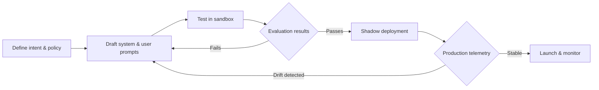

# Prompt Engineering Playbook

_Last updated: 2025-09-29_

The glossary captures a full stack of prompt-related terminology. Use this page as a
jumping-off point for crafting reliable instructions and understanding the knobs that
affect behavior.

**Quick links**

- [Role starter pack: Product & Program Managers](roles.md#product--program-managers)
- [Role starter pack: Engineering & Platform](roles.md#engineering--platform)
- [Search prompts & decoding terms](search.md?category=LLM%20Core)
- [Search governance touchpoints](search.md?category=Governance%20%26%20Risk&role=policy)
- [Safety classifier guide](terms/safety-classifier.md)
- [Robust prompting tips](terms/robust-prompting.md)

## Core concepts

- [Prompt engineering](terms/prompt-engineering.md) — overall workflow for iterating and testing prompts.
- [System prompt](terms/system-prompt.md) — immutable guardrail at the top of every conversation.
- [Context window](terms/context-window.md) — token budget that constrains prompt size and retrieved context.
- [Token](terms/token.md) — smallest unit models consume, essential for cost and context planning.

## Controlling outputs

- [Temperature](terms/temperature.md) — adjusts randomness in sampling; lower for consistency, higher for ideation.
- [Top-k sampling](terms/top-k-sampling.md) — limits sampling to the top *k* candidates per step.
- [Top-p sampling](terms/top-p-sampling.md) — chooses from the smallest probability mass that sums to *p*.
- [Repetition penalty](terms/repetition-penalty.md) — discourages loops or repeated phrases.
- [Beam search](terms/beam-search.md) — deterministic multi-path decoding for structured responses.
- [Self-consistency decoding](terms/self-consistency-decoding.md) — sample multiple reasoning chains and aggregate the dominant answer before finalizing.
- [Chain-of-thought prompting](terms/chain-of-thought-prompting.md) — encourage the model to reason step by step before committing to an answer.

## Grounding and retrieval aids

- [Retrieval-augmented generation](terms/retrieval-augmented-generation.md) — combine prompts with retrieved context.
- [Chunking](terms/chunking.md) and [vector stores](terms/vector-store.md) — structure knowledge bases for precise context windows.
- [Reranking](terms/reranking.md) — surface the best supporting passages before they enter the prompt.
- [Data lineage](terms/data-lineage.md) — keep track of where grounding data originated so prompt responses remain auditable.
- [Shadow deployment](terms/shadow-deployment.md) — run new prompts in parallel to capture telemetry before rollout.

## Safety and governance touchpoints

- [Guardrails](terms/guardrails.md) — policy-aligned controls before or after generation.
- [Safety evaluation](terms/safety-evaluation.md) — ensure prompt changes don’t undo previous approvals.
- [Model card](terms/model-card.md) & [content moderation](terms/content-moderation.md) — document and monitor prompt behavior in production.

### Prompt lifecycle diagram

Use the diagram above as a checklist: always close the loop from telemetry back into prompt iteration so governance signals stay current.

### Quick checklist before launch

1. Version system prompts in source control and log every change.
2. Benchmark prompts across accuracy, hallucination, fairness, jailbreak resilience, and latency metrics.
3. Validate context window usage with representative journeys (long, multilingual, regulated).
4. Document decoding settings (temperature, top-k/top-p, repetition penalties) in model cards.
5. Run red-teaming and safety evaluations when prompts or grounding data change.
6. Observe shadow deployments before launch, reviewing safety classifier scores and human handoff outcomes.

For deeper exploration, use the [interactive search](search.md) with the `LLM Core` category or filter by your team’s role.
